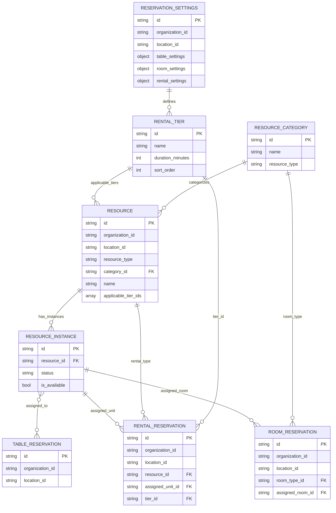

# Reservation Resource Model

## High-Level Diagram

```text
Business / Organization
        |
        +--> ReservationSettings (org/location-level configuration)
        |      |
        |      +--> TableReservationSettings
        |      +--> RoomReservationSettings
        |      +--> RentalReservationSettings
        |             |
        |             +--> RentalTierDefinition[] (1h, 2h, half-day, etc.)
        |
        +--> Location
               |
               +--> ResourceCategory (Table / Room / Rental groups)
               |      |
               |      +--> Resource (bookable definition)
               |              |
               |              +--> ResourceInstance (physical unit)
               |
               +--> Reservation Documents
                      |
                      +--> TableReservation  ----> ResourceInstance(s)
                      +--> RoomReservation   ----> ResourceCategory + ResourceInstance
                      +--> RentalReservation ----> Resource + ResourceInstance + TierId
```

## Mid-Level Diagram



## Core Entities

### ReservationSettings

Organization/location-level configuration for reservation behavior.

- `id`
- `organizationId`
- `locationId?` (null = org-wide defaults)
- `table` -> `TableReservationSettings`
- `room` -> `RoomReservationSettings`
- `rental` -> `RentalReservationSettings`

#### TableReservationSettings

- `settingType` (default: "capacity") - Reservation mode: `capacity` or `resource_specific`
- `defaultDurationMinutes` (default: 90)
- `turnoverMinutes` (default: 15)
- `maxPartySize?`
- `advanceBookingDays` (default: 30)

**Setting Type Behavior:**

| Mode | Use Case | Flow |
|------|----------|------|
| `capacity` | Daily restaurant ops | "Party of 4 at 7pm" → system assigns tables |
| `resource_specific` | Events, VIP, private dining | "Book the private room" → customer picks resource |

#### RoomReservationSettings

- `checkInTime` (HH:mm, default: "15:00")
- `checkOutTime` (HH:mm, default: "11:00")
- `minStayNights` (default: 1)
- `maxStayNights?`
- `advanceBookingDays` (default: 90)

#### RentalReservationSettings

- `tiers[]` -> `RentalTierDefinition`
- `requireWaiver` (default: false)
- `requireIdVerification` (default: false)
- `defaultDepositPercent?`

#### RentalTierDefinition

- `id`
- `name` (e.g., "Half Day", "2 Hours")
- `durationMinutes`
- `sortOrder`

---

### ResourceCategory
- `id`
- `name`
- `resourceType` (`table` | `room` | `rental` | `resource`)

### Resource
- `id`
- `organizationId`
- `locationId`
- `resourceType`
- `categoryId?` -> `ResourceCategory.id`
- `name`
- `description?`
- `capacity?`
- `capacityConfig?`
- `pricing?`
- `turnoverMinutes?`
- `attributes?`
- `bookingRules?`
- `depositStrategy?`
- `instances?` -> `ResourceInstance.id[]`

### ResourceInstance
- `id`
- `resourceId` -> `Resource.id`
- `organizationId`
- `locationId?`
- `name?`
- `code?`
- `status`
- `isAvailable`
- `attributes?`

## Relationship Diagram

```text
ResourceCategory (1) -------- (*) Resource
                                  |
                                  | (1) -------- (*) 
                                  v
                           ResourceInstance
```

## Reservation Attachments

- `TableReservation.tableIds[]` -> `ResourceInstance.id`
- `RoomReservation.roomTypeId` -> `ResourceCategory.id`
- `RoomReservation.assignedRoomId` -> `ResourceInstance.id`
- `RentalReservation.resourceId` -> `Resource.id`
- `RentalReservation.resourceInstanceId` -> `ResourceInstance.id`
- `RentalReservation.tierId` -> `ReservationSettings.rental.tiers[].id`

---

## Resource Schema Details

### Resource Types

| Type | Use Case | Capacity | Pricing |
|------|----------|----------|---------|
| `table` | Restaurant tables | range (min/max party) | none |
| `room` | Hotel rooms | occupancy (standard/max) | dayOfWeek |
| `rental` | Equipment, spaces | single (value) | tiered |
| `resource` | Generic | any | any |

---

## Capacity Strategies

Discriminated union on `kind` field.

### Range (Tables)

```typescript
{
    kind: "range",
    min: 2,    // Minimum party size
    max: 6     // Maximum party size
}
```

### Occupancy (Rooms)

```typescript
{
    kind: "occupancy",
    standard: 2,      // Standard occupancy
    max: 4,           // Maximum occupancy
    extraFee: 50.00   // Fee per extra guest (optional)
}
```

### Single (Rentals)

```typescript
{
    kind: "single",
    value: 1,              // Capacity value
    weightLimit: 250,      // Optional weight limit (lbs)
    skillLevel: "beginner" // Optional skill requirement
}
```

---

## Pricing Strategies

Discriminated union on `kind` field.

### None (Tables)

```typescript
{
    kind: "none",
    holdPolicy: "30-minute hold, then released"  // Optional
}
```

### Day of Week (Rooms)

```typescript
{
    kind: "dayOfWeek",
    rates: {
        mon: 99.00,  tue: 99.00,  wed: 99.00,  thu: 99.00,
        fri: 149.00, sat: 179.00, sun: 129.00
    }
}
```

### Tiered (Rentals)

```typescript
{
    kind: "tiered",
    tiers: [
        { from: 0, to: 1, price: 25.00 },   // First hour
        { from: 1, to: 4, price: 20.00 },   // Hours 2-4
        { from: 4, to: null, price: 15.00 } // 4+ hours
    ]
}
```

---

## Resource Schema Fields

### Core Fields

| Field | Type | Description |
|-------|------|-------------|
| `organizationId` | string | Business account ID |
| `locationId` | string? | Business location ID |
| `resourceType` | ResourceType | table \| room \| rental \| resource |
| `categoryId` | string? | Resource category reference |
| `name` | string | Resource name |
| `description` | string? | Resource description |
| `isAvailable` | boolean | Availability flag (default: true) |

### Capacity & Pricing

| Field | Type | Description |
|-------|------|-------------|
| `capacity` | number? | Simple capacity value |
| `capacityConfig` | ResourceCapacity? | Type-specific capacity config |
| `pricing` | ResourcePricingStrategy? | Type-specific pricing strategy |

### Booking Configuration

| Field | Type | Description |
|-------|------|-------------|
| `bookingRules` | ServiceBookingRules? | Shared booking rules |
| `depositStrategy` | ServiceDepositStrategy? | Deposit requirements |
| `reservationDuration` | number? | Default duration |
| `reservationDurationUnit` | minutes \| hours \| nights | Duration unit |
| `turnoverMinutes` | number? | Reset/cleanup time |

### Location & Features

| Field | Type | Description |
|-------|------|-------------|
| `location` | string? | Physical location description |
| `amenities` | string[] | Available amenities |
| `attributes` | ResourceAttribute[]? | Key/value pairs |
| `instances` | string[]? | Resource instance IDs |

### Rental Configuration

| Field | Type | Description |
|-------|------|-------------|
| `applicableTierIds` | string[] | Tier IDs from ReservationSettings.rental.tiers |
| `checklistTemplate` | ChecklistTemplateItem[] | Pickup/return checklist items |
| `metadata` | Record<string, any>? | Additional metadata |

---

## Rental Tier Flow

```text
ReservationSettings.rental.tiers[]     ← Organization defines available tiers
              ↓
Resource.applicableTierIds[]           ← Resource specifies which tiers apply
              ↓
RentalReservation.tierId               ← Reservation references selected tier
```

### Example Tier Configuration

**Organization Settings:**

```typescript
const settings: ReservationSettings = {
    organizationId: "org_123",
    rental: {
        tiers: [
            { id: "tier_1h", name: "1 Hour", durationMinutes: 60, sortOrder: 0 },
            { id: "tier_2h", name: "2 Hours", durationMinutes: 120, sortOrder: 1 },
            { id: "tier_half", name: "Half Day", durationMinutes: 240, sortOrder: 2 },
            { id: "tier_full", name: "Full Day", durationMinutes: 480, sortOrder: 3 },
        ],
        requireWaiver: true,
        requireIdVerification: false,
    },
};
```

**Resource with Applicable Tiers:**

```typescript
const kayak: CreateResource = {
    organizationId: "org_123",
    locationId: "loc_456",
    resourceType: "rental",
    name: "Single Kayak",
    capacityConfig: { kind: "single", value: 1, weightLimit: 250 },
    pricing: {
        kind: "tiered",
        tiers: [
            { from: 0, to: 1, price: 30.00 },
            { from: 1, to: 4, price: 25.00 },
            { from: 4, to: null, price: 20.00 },
        ],
    },
    applicableTierIds: ["tier_2h", "tier_half", "tier_full"], // No 1-hour rentals for kayaks
    checklistTemplate: [
        { id: "chk_helmet", label: "Helmet included", required: true, phase: "pickup" },
        { id: "chk_paddle", label: "Paddle included", required: true, phase: "pickup" },
    ],
};
```

**Reservation with Selected Tier:**

```typescript
const reservation: CreateRentalReservation = {
    organizationId: "org_123",
    customerId: "cust_456",
    resourceId: "res_kayak",
    tierId: "tier_half", // Half Day selected
    startAt: 1700000000000,
    endAt: 1700014400000,
    // ...
};
```

---

## Checklist Flow

```text
Resource.checklistTemplate[]           ← Resource defines checklist items
              ↓
RentalReservation.checklistCompletions[]  ← Reservation tracks completions
```

### ChecklistTemplateItem (on Resource)

| Field | Type | Description |
|-------|------|-------------|
| `id` | string | Checklist item ID |
| `label` | string | "Helmet included", "Brakes working" |
| `required` | boolean | Must be checked (default: true) |
| `phase` | "pickup" \| "return" \| "both" | When to check (default: "both") |

### ChecklistCompletion (on RentalReservation)

| Field | Type | Description |
|-------|------|-------------|
| `itemId` | string | Reference to ChecklistTemplateItem.id |
| `completed` | boolean | Whether item is completed |
| `completedAt` | number? | Completion timestamp |
| `completedBy` | string? | User ID who completed |

---

## Validation Rules

### Capacity Validation

| Rule | Condition |
|------|-----------|
| Range max >= min | `capacityConfig.kind === "range"` |
| Occupancy max >= standard | `capacityConfig.kind === "occupancy"` |

### Type-Specific Enforcement

| Resource Type | Required Capacity | Required Pricing |
|---------------|-------------------|------------------|
| `table` | `range` | `none` |
| `room` | `occupancy` | `dayOfWeek` |
| `rental` | `single` | `tiered` |

---

## Usage Examples

### Table Resource

```typescript
const table: CreateResource = {
    organizationId: "org_123",
    locationId: "loc_456",
    resourceType: "table",
    name: "Table 5",
    capacityConfig: {
        kind: "range",
        min: 2,
        max: 6,
    },
    pricing: {
        kind: "none",
        holdPolicy: "30-minute hold policy",
    },
    amenities: ["window", "booth"],
    turnoverMinutes: 15,
};
```

### Room Resource

```typescript
const room: CreateResource = {
    organizationId: "org_123",
    locationId: "loc_456",
    resourceType: "room",
    name: "Ocean Suite",  // Room type name (instances have room numbers)
    capacityConfig: {
        kind: "occupancy",
        standard: 2,
        max: 4,
        extraFee: 50.00,
    },
    pricing: {
        kind: "dayOfWeek",
        rates: {
            mon: 199, tue: 199, wed: 199, thu: 199,
            fri: 299, sat: 349, sun: 249,
        },
    },
    amenities: ["wifi", "minibar", "balcony", "ocean-view", "king-bed", "non-smoking"],
    reservationDurationUnit: "nights",
};

// ResourceInstance for this room type:
const roomInstance: CreateResourceInstance = {
    organizationId: "org_123",
    resourceId: "res_ocean_suite",
    code: "301",  // Room number
    status: ResourceInstanceStatus.AVAILABLE,
    isAvailable: true,
};
```

### Rental Resource

```typescript
const kayak: CreateResource = {
    organizationId: "org_123",
    locationId: "loc_456",
    resourceType: "rental",
    name: "Single Kayak",
    capacityConfig: {
        kind: "single",
        value: 1,
        weightLimit: 250,
        skillLevel: "beginner",
    },
    pricing: {
        kind: "tiered",
        tiers: [
            { from: 0, to: 1, price: 30.00 },
            { from: 1, to: 4, price: 25.00 },
            { from: 4, to: null, price: 20.00 },
        ],
    },
    applicableTierIds: ["tier_2h", "tier_half", "tier_full"],
    checklistTemplate: [
        { id: "chk_helmet", label: "Helmet included", required: true, phase: "pickup" },
        { id: "chk_paddle", label: "Paddle included", required: true, phase: "pickup" },
        { id: "chk_damage", label: "No visible damage", required: true, phase: "both" },
    ],
    reservationDurationUnit: "hours",
};
```

---

## Query Options

### Filters

| Field | Type | Description |
|-------|------|-------------|
| `search` | string? | Text search |
| `locationId` | string? | Filter by location |
| `resourceType` | ResourceType[]? | Filter by types |
| `isAvailable` | boolean? | Availability filter |
| `capacityRange` | { min?, max? }? | Capacity range filter |
| `location` | string? | Physical location filter |
| `includeDeleted` | boolean? | Include soft-deleted |

### Sorting

| Field | Options |
|-------|---------|
| `field` | name \| capacity \| createdAt |
| `direction` | asc \| desc |
